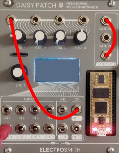

# DaisyMutations Torus Plus

Mutable Instruments Rings for the Daisy Patch.  

**Version: 1.03**

The **"Plus"** version adds some features that allow to experiment with the patch without any other external gear.

Differences between Torus Plus and Torus:

```
+ delay effect (with time/feedback and mix control)
+ menu rearranged and different default knobs assignment
+ an internal random duophonic note/rythm generator
+ white noise on AUDIO2
+ different (better?) 1V/oct tracking
+ extra LFO or random CV signal
+ audio input mix
+ test mode
+ mono mode (polyphony 2 and 4 split the audio signal in the original version)
```

You can download the (latest) compiled firmware here:

- [TorusPlus.bin](../../firmwares/TorusPlus.bin)

Enhancements by: Marzio De Biasi (AlgoritmArte)  
Ported by: Ben Sergentanis  
Originally by: Émilie Gillet

Please refer to the [Rings manual](https://mutable-instruments.net/modules/rings/manual/) for more detail on everything Rings. 

If you find some probelms or have suggestions, contact me: development [at] algoritmarte [dot] com

## Controls and I/O

Summary:

|Control            | Function  |
|-------------------|-----------|
| Ctrl 1 (default)  | Frequency |
| Ctrl 2 (default)  | Structure |
| Ctrl 3 (default)  | Damping   |
| Ctrl 4 (default)  | Position  |
| Gate In 1         | Trigger In (Rings Strum)  |
| Gate In 2         | _unused_            |
| Audio In 1        | External Exciter In _(still under testing)_|
| Audio In 2        | _unused_            |
| Audio In 3 + 4    | Stereo input that can be mixed with the output of rings
| Audio Out 1       | Left Out (or Mono)  |
| Audio Out 2       | Right Out           |
| Audio Out 3       | White noise         |
| Audio Out 4       | Extra trigger when in "bassline" mode (the trig is generated also in other modes)|
| Gate Out 1        | Triggered when the internal generator generates a new note |
| CV Out 1          | 1V/oct of the note generated by the internal generator     |

| CV Out 2          | 1V/oct of the bass note when in "bassline" mode            |
| Encoder           | Menu Navigation |

NOTE: there is no "normalized internal route", so in order to use the internal note/rythm generator you should self patch the Daisy connecting :

- CV Out1 ===> CTRL1 (frequency)
- Gate Out1 ===> Gate In 1 (trigger in)



 

## Menus

### Polyphony
Polyphony: How many voices can play at once. Polyphony modes 2 and 4 cause every other note to hardpan left and right.

  - One
  - Two (default)
  - Four

### Model
Model: The resonator model to be used.

  - Modal (default)
  - Sympathetic Strings
  - Inharmonic Strings
  - FM Voice
  - Western Chords
  - String and Reverb

### Delay time / Delay feedback / Delay Mix

Controls:
  
- delay time
- delay feedback
- delay mix

### Plus

Controls the internal note rythm random generator:

- BPM : tempo in beats per minute
- Zoom : the zoom on the "pseudo fractal" note generator; *usually adjusting it in combination with Note offset can lead to interesting results*; lower values means higher probability towards the "base" note of the scale;
- Note offset : base note of the (diatonic) scale; *usually adjusting it in combination with Zoom can lead to interesting results*;
- Scale : scales used by the note generator: Major, Minor, Pentatonic or Phrygian;
- Randomize ... there is no detailed control over the parameters of the generative process, so "you should trust your eurorack system", if you don't like the results click Randomize and soon or later *something happy will happen* :-)
- Test mode : the C D E F G A B C scale is repeated on CV1 out / Gate 1

### Mod

Controls the function of CV2:

- Mode: can be
	+ LFO (default): in this mode CV2 is a sine wave which freqeuncy and amplitude is controlled by Mod.Freq and Mod.Gain
	+ RAND: in this mode CV2 is set to a random voltage whenever a new "bass" note is generated;  the amplitude of the value is controlled by Mod.Gain
	+ BASS LINE: in this mode CV1 Out/Gate 1 out "plays" the higher line of the randomly generated melody, CV2 Out/Audio 4 "plays" the bass line of the melody (audio 4 is used as a trigger)
- Mod. Freq: controls the frequency of the LFO in LFO mode
- Mod. Gain: controls the amplitude of the LFO in LFO mode, or the range of random voltages in RAND mode

Due to the hardware architecture, LFO and RANDs are unipolar (positive values).

### Audio mix

Audio 3+4 can be mixed with the output signal of Rings (_actually after the delay, but an option to mix it before the delay will be added soon_).

The mix value has a default value of 0.25 which should be fine for Eurorack audio levels; if you use Line levels you must increase it.


### Normalize
This menu simulates the normalization detection used on Rings.  
For proper behavior you **must** turn on normalization for each of the controls you have patched.  

These are:

- Exciter (default OFF)
- Note (default ON)
- Strum (default ON)
- Easter Egg enable/disable: used to toggle easter egg mode (default OFF)

### Easter Egg FX

Easter Egg FX: Change the effect used in easter egg mode:

  - Formant
  - Chorus
  - Reverb
  - Formant 2
  - Ensemble
  - Reverb 2

### Mono output

Merge AUDIO1 and AUDIO2 into AUDIO1 (useful if polyphony is 2 or 3 and you cannot handle a stereo signal on you system)

### Controls
Use this menu to customize Rings' five controls to the Daisy Patch's four.
Your options are:

- Frequency (default KNOB1)
- Structure (default KNOB2)
- Damping (default KNOB3)
- Position (default KNOB4)
- Brightness

### History

    2020-01-20 v1.00 first Plus version
    2020-01-26 v1.01 better handling of 1V/oct input
    2020-01-29 v1.02 added CV2 modulation options, scales and audio in mix
    2020-01-30 v1.03 improved audio mixing, test scale on CV1